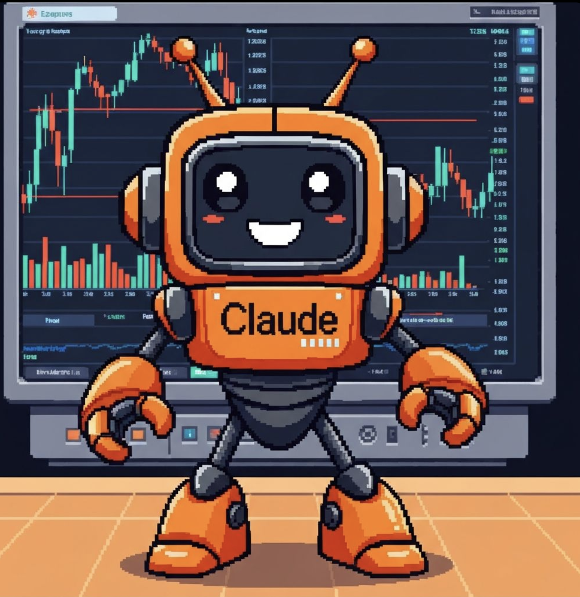

# 🤖 CladBot

A Claude-powered autonomous trading agent that analyzes and trades tokens on pump.fun.



## Features

- 🔍 **AI-Powered Analysis**: Uses Claude AI to analyze token metrics, market sentiment, and trading patterns
- 📊 **Real-time Monitoring**: Continuously monitors pump.fun for new token launches
- 💰 **Automated Trading**: Executes buy/sell orders based on AI analysis and configured strategies
- 📈 **Risk Management**: Built-in stop-loss, take-profit, and position sizing
- 📝 **Trade Logging**: Comprehensive logging of all trades and decisions

## Architecture

```
cladbot/
├── src/
│   ├── agents/          # Claude AI trading agents
│   ├── analyzers/       # Token analysis modules
│   ├── traders/         # Trading execution logic
│   └── monitors/        # Market monitoring
├── config/              # Configuration files
├── logs/                # Trade logs
└── tests/               # Unit tests
```

## Setup

1. Clone the repository:
```bash
git clone https://github.com/yourusername/cladbot.git
cd cladbot
```

2. Install dependencies:
```bash
pip install -r requirements.txt
```

3. Configure environment variables:
```bash
cp .env.example .env
# Edit .env with your API keys
```

4. Run the bot:
```bash
python main.py
```

## Configuration

Edit `config/config.yaml` to customize:
- Trading strategies
- Risk parameters
- Token filters
- Analysis criteria

## Environment Variables

Required:
- `ANTHROPIC_API_KEY`: Your Claude API key
- `SOLANA_RPC_URL`: Solana RPC endpoint
- `WALLET_PRIVATE_KEY`: Trading wallet private key
- `PUMPFUN_API_KEY`: Pump.fun API access

## Safety & Disclaimers

⚠️ **WARNING**: Cryptocurrency trading carries significant risk. This bot is for educational purposes. Always:
- Start with small amounts
- Test thoroughly on devnet
- Monitor the bot's performance
- Never invest more than you can afford to lose

## License

MIT License - See LICENSE file for details
